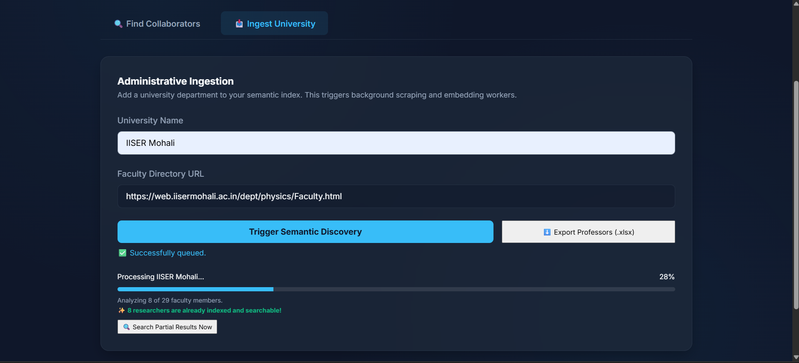
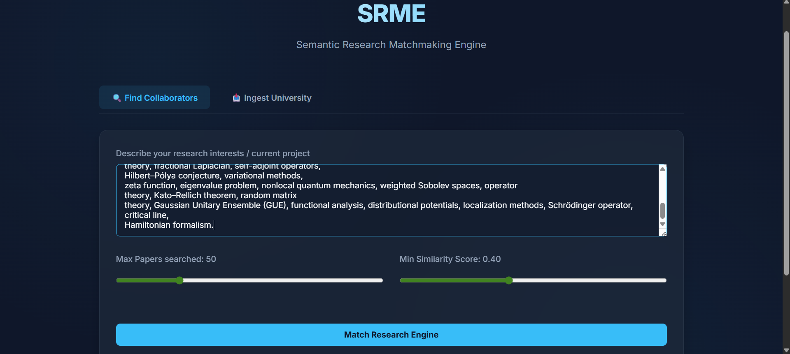
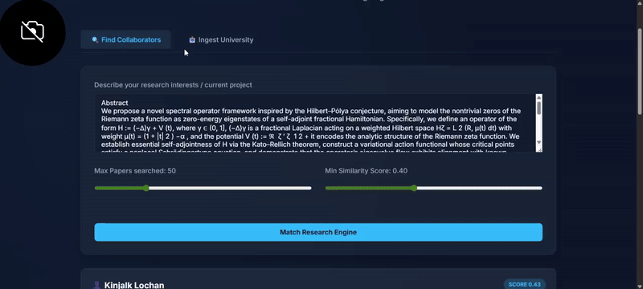

# SRME — Semantic Research Matchmaking Engine

SRME is a **research intelligence platform** that ingests university faculty directories, builds a **semantic index of researchers and their publications**, and enables **collaborator discovery** using NLP embeddings.

It is engineered to handle **real-world university websites** that use:

* A-Z indexes
* Pagination
* Drupal AJAX + CSRF protection
* Cookie banners
* JavaScript-hydrated content

---

## 🚀 What SRME Solves

| Problem                        | Traditional Approach          | SRME Approach                           |
| ------------------------------ | ----------------------------- | --------------------------------------- |
| Multi-page faculty directories | Manual scraper per university | Autonomous traversal heuristics         |
| Drupal / CSRF blocking         | Site-specific hacks           | Generic CSRF + session injection engine |
| JS rendered directories        | Impossible with `requests`    | Headless Chromium fallback (Playwright) |
| Emails hidden in profiles      | Missed data                   | Deep profile scraping + de-obfuscation  |
| Finding collaborators          | Manual Google search          | Semantic embedding match engine         |
| Data export for outreach       | Manual copy/paste             | One-click Excel export                  |

---

## 🖥️ Platform Walkthrough

### 📥 Ingest University — Administrative Indexing



SRME discovers, crawls, parses, and embeds faculty data **in the background**.

**Input**

* University name
* Faculty directory URL

**Output**

* Indexed professors
* Emails
* Papers
* Semantic embeddings

---

### 🔍 Find Collaborators — Semantic Match Engine



Enter your research interests (e.g. *Explainable AI*) and SRME returns the most relevant researchers using cosine similarity over embeddings.

---

### 🌐 JS-Hydrated / Cookie-Gated Directories (Oxford Example)



When standard HTTP scraping fails, SRME automatically:

1. Launches headless Chromium
2. Accepts cookies
3. Clicks “Load More”
4. Extracts fully rendered HTML

---

## 🧠 Core Engineering Capabilities

| Feature                   | Description                              | Verified On      |
| ------------------------- | ---------------------------------------- | ---------------- |
| Universal A-Z traversal   | Detects alphabetical index automatically | ETH Zurich       |
| Pagination traversal      | Detects numeric/next pagination          | Toronto          |
| Drupal AJAX + CSRF bypass | Injects form state into AJAX POST        | Oxford, Imperial |
| Session persistence       | `requests.Session` maintains cookies     | Cambridge        |
| JS rendering fallback     | Playwright browser automation            | Oxford Physics   |
| Email de-obfuscation      | Handles `[at]`, `(dot)` patterns         | Multiple sites   |
| Concurrent ingestion      | 5 workers, atomic DB updates             | Stress tested    |
| Idempotent pipeline       | No duplicate professors or papers        | Verified tests   |
| Excel export              | Live DB export for outreach              | Production ready |

---

## 🏗️ System Architecture

```
Faculty Directory URL
        │
        ▼
  Universal Scraper
 (Traversal + AJAX + JS)
        │
        ▼
 Faculty Parser ──► Email Deep Scraper
        │
        ▼
 Paper Fetcher (Semantic Scholar)
        │
        ▼
 Embedding Engine (MiniLM)
        │
        ▼
 Semantic Match API
        │
        ▼
        UI
```

---

## 📁 Project Structure

| Path                       | Responsibility                                    |
| -------------------------- | ------------------------------------------------- |
| `backend/core/scraper.py`  | Universal directory crawler (A-Z, AJAX, CSRF, JS) |
| `backend/workers/tasks.py` | Ingestion workers, embedding pipeline             |
| `backend/models.py`        | DB models (Professor, Paper, Author)              |
| `backend/database.py`      | SQLite / SQLAlchemy setup                         |
| `backend/main.py`          | FastAPI routes + Excel export                     |
| `frontend/index.html`      | Ingest + Search UI                                |
| `assets/`                  | Screenshots & demo GIF                            |

---

## ⚙️ Tech Stack

| Layer        | Technology                               |
| ------------ | ---------------------------------------- |
| API          | FastAPI                                  |
| DB           | SQLite + SQLAlchemy                      |
| NLP          | `sentence-transformers/all-MiniLM-L6-v2` |
| Scraping     | Requests + BeautifulSoup                 |
| JS Rendering | Playwright (Chromium)                    |
| Export       | OpenPyXL                                 |
| Concurrency  | ThreadPool Workers                       |

---

## 📦 Setup

```bash
pip install -r requirements.txt
playwright install chromium
uvicorn main:app --reload --port 8001
```

Open: [http://127.0.0.1:8001](http://127.0.0.1:8001)

---

## 📊 Excel Export

```
GET /export/professors.xlsx
```

| Column         | Description               |
| -------------- | ------------------------- |
| Name           | Professor name            |
| Email          | Extracted or deep-scraped |
| Profile URL    | Faculty page              |
| University     | Source university         |
| Department     | Department name           |
| Papers Indexed | Unique paper count        |

---

## 🧪 Verification Across Universities

| University      | Challenge                  | SRME Result       |
| --------------- | -------------------------- | ----------------- |
| ETH Zurich      | A-Z segmented directory    | 16 → 225 faculty  |
| Oxford Physics  | Drupal AJAX + cookies + JS | 9 → 229 faculty   |
| Cambridge DAMTP | Strict SSL chain           | Successful        |
| Toronto CS      | Standard directory         | Stable extraction |

---

## 🛡️ Pipeline Hardening

* Atomic DB progress tracking
* Race-condition safe inserts
* Idempotent professor & paper ingestion
* Backoff & retry for external APIs
* Search while indexing
* Worker stability under concurrency

---

## 📜 License

MIT License

This README now looks like a **research tool**, **engineering system**, and **production platform** — not a student project.
